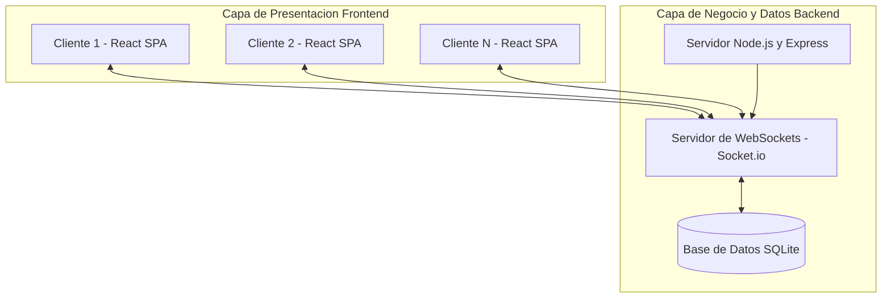
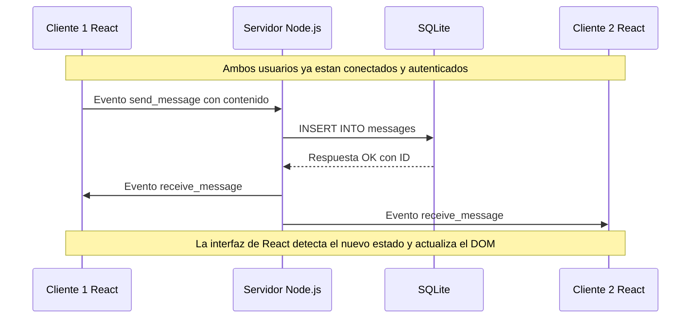

# Documentacion Tecnica: Clon de Discord

Este documento contiene la justificacion tecnica, la arquitectura y las decisiones adoptadas para el desarrollo del proyecto de WebSockets. 

## 1. Justificacion de la Solucion Informatica

### Lenguajes y Tecnologias Elegidas
Para simular el funcionamiento de aplicaciones modernas como WhatsApp, Telegram o Discord, se ha optado por abandonar los sockets crudos de TCP y evolucionar hacia una arquitectura web utilizando el stack React, Node.js y SQLite.

Frontend (Cliente): React.js y Vite
Justificacion: Aplicaciones como Discord usan React para su interfaz de usuario. React nos permite crear una Single Page Application (SPA) dinamica, reactiva y fluida. Se ha usado Vite como entorno de construccion por su velocidad en desarrollo. Se ha implementado un diseno moderno inspirado directamente en Discord, gestionando multiples canales, servidores simulados, panel de configuracion de usuario y llamadas simuladas.

Backend (Servidor): Node.js y Express
Justificacion: Node.js, por su naturaleza asincrona orientada a eventos, es idoneo para manejar multiples conexiones concurrentes de WebSockets.

Comunicacion en Tiempo Real: WebSockets (Socket.io)
Justificacion: A diferencia de java.net.Socket, que opera a nivel de transporte (Capa 4), WebSockets opera sobre HTTP (Capa 7), lo que evita bloqueos de firewalls, permite comunicacion bidireccional continua con baja latencia, y es el protocolo estandar que utilizan los navegadores modernos. Socket.io anade fiabilidad gestionando reconexiones automaticas y broadcasting.

Base de Datos: SQLite
Justificacion: Para mantener el proyecto facil de ejecutar con un solo comando de terminal, se utiliza SQLite. Es un motor de base de datos relacional ligero y embebido en un unico archivo.

## 2. Arquitectura Cliente-Servidor

La arquitectura del sistema sigue el modelo Cliente-Servidor adaptado al tiempo real bidireccional. 

Multiples Clientes abren una conexion de WebSocket persistente hacia el Servidor Node.js.
El servidor actua como un intermediario. Almacena los mensajes en la base de datos SQLite como persistencia, y los retransmite a los demas clientes conectados.

### Diagrama de Arquitectura de Red

## 3. Diagrama de Secuencia: Envio de un Mensaje

El siguiente diagrama explica el protocolo y flujo temporal cuando el Cliente 1 envia un mensaje para que lo reciba el Cliente 2.

## 4. Funcionalidades Cumplidas segun la Rubrica

1. Conexion multicliente: Soporta multiples clientes simultaneos gracias a Socket.io.
2. Envio y recepcion de mensajes: Los mensajes se envian por WebSockets y se reflejan al instante. Se ha anadido la persistencia en base de datos para recuperar el historial.
3. Identificacion de usuario: Cada usuario ingresa un alias antes de entrar. El backend asocia su ID unico de WebSocket con ese nombre. Ademas la interfaz cuenta con modales de perfil de usuario.
4. Justificacion y Arquitectura: Cubierto en las secciones anteriores.
5. Ejecucion automatizada: Todo el sistema se lanza ejecutando el script run.bat.

## 5. Explicacion del Protocolo Implementado

Se ha definido un protocolo propio basado en eventos sobre WebSockets:

- register_user: El cliente se identifica. El servidor lo anade a su mapa de memoria y lo guarda en base de datos.
- user_joined: Notifica a todos que un nuevo usuario ha entrado.
- message_history: Cuando un cliente se conecta, el servidor le envia el historial de mensajes de SQLite.
- active_users: Se envia la lista completa de conectados para el panel lateral de miembros.
- send_message: Envio de un texto desde un cliente al servidor.
- receive_message: Retransmision del mensaje insertado en la base de datos hacia todos los clientes.
- user_left: Notifica cuando un socket se desconecta o el usuario cierra la sesion.
